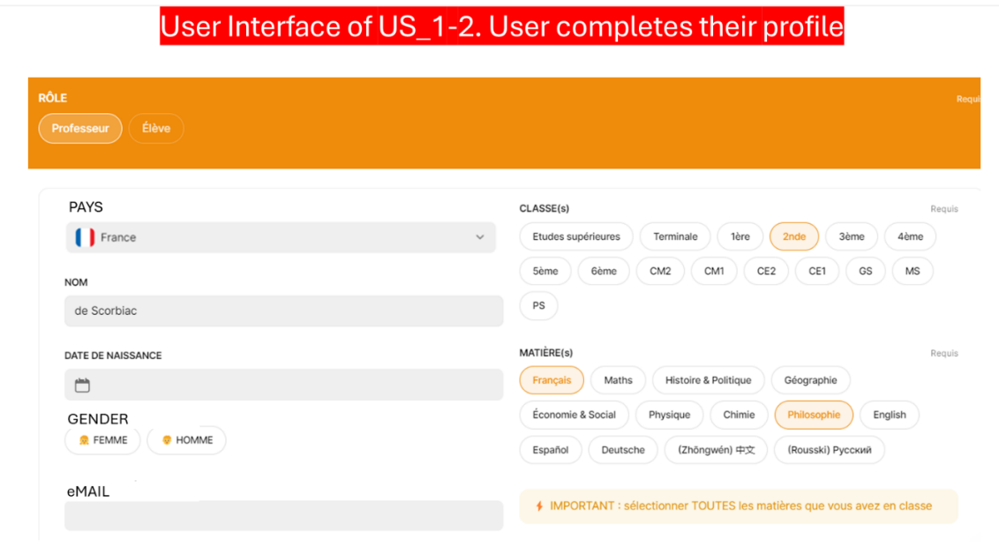
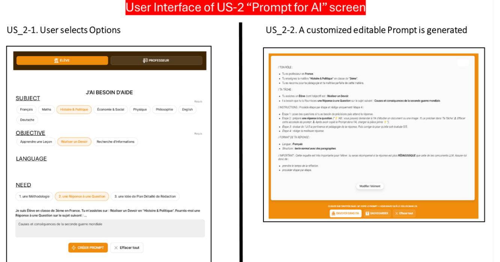

# AI for ALL

A Chrome extension that generates customized prompts automatically for students and teachers. It provides various educational aids such as simplified explanations, detailed summaries, mnemonic tricks, and more.

## Table of Contents

- [Installation](#installation)
- [Features](#features)
- [Usage](#usage)
- [Development](#development)
- [Configuration](#configuration)
- [Scripts](#scripts)
- [Testing](#testing)
- [Deployment](#deployment)
- [Contributing](#contributing)
- [License](#license)
- [Acknowledgements](#acknowledgements)

## Installation

### Prerequisites

- Google Chrome browser

### Steps to Install

#### From the Chrome Web Store

1. Visit the [Chrome Web Store](#).
2. Search for `AI for ALL`.
3. Click `Add to Chrome`.

#### From Source

1. Clone the repository:
   ```sh
   git clone https://github.com/AyS-0908/ikido_extension_files
   ```
2. Navigate to the project directory:
   ```sh
   cd ikido_extension_files
   ```
3. Open Chrome and navigate to `chrome://extensions/`.
4. Enable `Developer mode`.
5. Click `Load unpacked` and select the project directory.

## Features

- **Profile Management**: Save and manage user profiles.
- **Prompt Generation**: Generate customized educational prompts based on user input.
- **Multilingual Support**: Supports English and French.
- **Rate Limiting**: Limits the number of requests per minute to avoid API abuse.
- **Google Sheets Integration**: Save user profiles and track request counts using Google Sheets.

## Usage

1. Click on the extension icon in the Chrome toolbar.
2. Set up your profile if it's your first time using the extension.
3. Select the necessary options (class, subject, objective, need, language).
4. Enter the details in the provided textarea.
5. Click `Generate Prompt` to create a customized prompt.
6. The prompt will be copied to your clipboard and pasted into the AI chatbot.

### Screenshots/GIFs




## Development

### Local Development Setup

1. Clone the repository:
   ```sh
   git clone https://github.com/AyS-0908/ikido_extension_files
   ```
2. Navigate to the project directory:
   ```sh
   cd ikido_extension_files
   ```
3. Open Chrome and navigate to `chrome://extensions/`.
4. Enable `Developer mode`.
5. Click `Load unpacked` and select the project directory.

### File Structure

```plaintext
ai-for-all-extension/
├── src/
│   ├── background.js
│   ├── config.js
│   ├── content.js
│   ├── i18n.js
│   ├── popup/
│   │   ├── popup.html
│   │   ├── popup.js
│   │   └── popup.css
│   ├── sheets.js
│   ├── styles.css
│   ├── user_profile.html
│   └── user_profile.js
├── _locales/
│   ├── en/
│   │   └── messages.json
│   ├── fr/
│   │   └── messages.json
├── icons/
│   ├── icon16.png
│   ├── icon48.png
│   └── icon128.png
├── manifest.json
└── README.md
```

## Configuration

### Environment Variables

- `API_KEY`: Your Google API key (stored in `chrome.storage.local`).

### Configuration Files

- **manifest.json**: Contains the extension's metadata and permissions.

## Scripts

- `background.js`: Handles background tasks such as extension installation and startup.
- `config.js`: Manages configuration settings, including the API key.
- `content.js`: Handles content scripts to interact with web pages.
- `i18n.js`: Manages internationalization strings.
- `popup.js`: Handles the popup's functionality.
- `sheets.js`: Manages Google Sheets interactions.
- `user_profile.js`: Handles user profile setup and management.

## Testing

### Running Tests

Currently, there are no automated tests for this project.

### Writing Tests

Brief guidelines or examples for writing tests could be added here in the future.

## Deployment

### Deploying to the Chrome Web Store

1. Navigate to the [Chrome Web Store Developer Dashboard](https://chrome.google.com/webstore/developer/dashboard).
2. Click `Add a new item`.
3. Upload the ZIP file of your extension.
4. Fill in the required details and submit for review.

## Contributing

Guidelines for contributing to the project.

1. Fork the repository.
2. Create a new branch (`git checkout -b feature/your-feature`).
3. Commit your changes (`git commit -am 'Add some feature'`).
4. Push to the branch (`git push origin feature/your-feature`).
5. Create a new Pull Request.

## License

This project is licensed under the MIT License.

## Acknowledgements

- [Google Sheets API](https://developers.google.com/sheets/api) - Used for saving and managing user profiles.

## Contributors

- [Aymard de Scorbiac](https://github.com/AyS-0908)
- [Sami Mhidia](https://github.com/samimhidia1)
